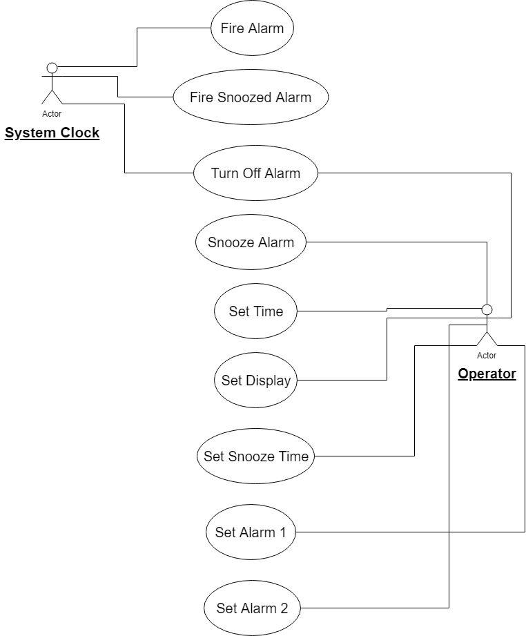

# AlarmClockProject
Alarm Clock Project for CMP_SC 4320: Software Engineering 1
# Name: Sai Akshay Chavakula
## Project Description
Identify the top-level functional requirement for the clock, and model it with a use case diagram.  (Use case description will come later.  Only create the use case diagram now.)
## Use Case Diagram

